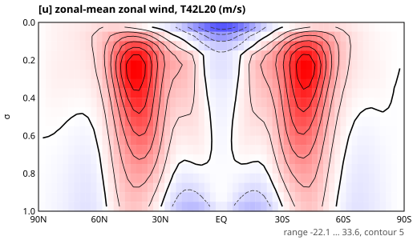
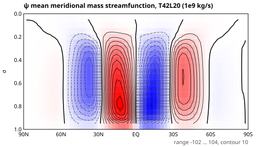
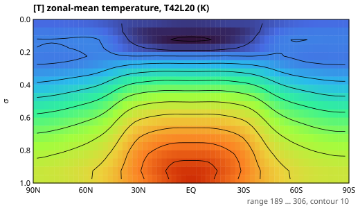
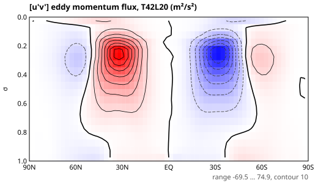
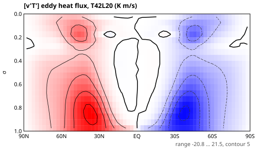
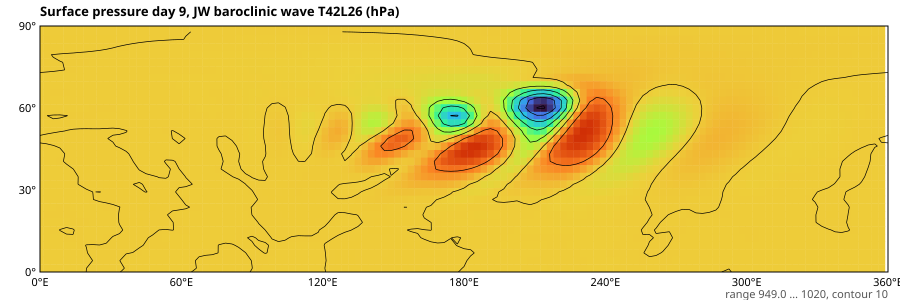
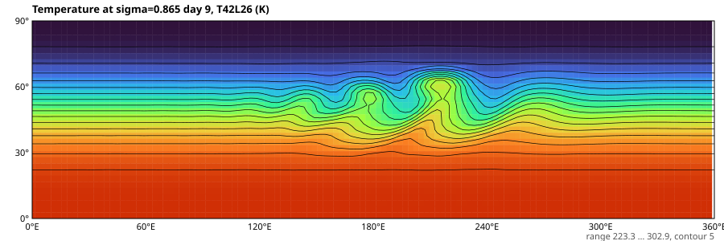
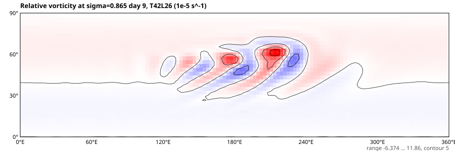

# R1 乾大氣驗收結果 / Dry-core validation results（2026-09-26）

所有結果均由靜止或平衡初始場自行演化而來；程式中沒有任何噴流、環流胞或氣旋的生成規則。
All results evolve from rest (or a balanced state plus a 1 m/s bump); nothing prescribes jets, cells or cyclones.

## 1. Held–Suarez (1994) 乾大氣氣候 / Dry climate

設定：T42（128×64 Gaussian）、L20 等距 σ、Δt = 1200 s；由水平均勻的靜止大氣（全球平均輻射平衡溫度廓線 + 0.1 K 雜訊）起步，spin-up 200 日，平均 300 日（每 6 小時取樣，1200 筆）。
Setup: T42 L20, Δt = 1200 s, started from rest with a horizontally uniform profile + 0.1 K noise; 200-day spin-up, 300-day average.

| 診斷 / Diagnostic | 本模式 T42 / This model | 文獻 / Reference (HS94, Wan et al. 2008) |
|---|---|---|
| 噴流極大 / Jet maximum | NH 33.6 m/s @ 43.3°N；SH 33.3 m/s @ 40.5°S；σ ≈ 0.22 | ≈ 30–31 m/s @ ~45°, ~250 hPa |
| 熱帶地面風 / Tropical surface wind | −7 ~ −8 m/s（信風 / trades） | 東風 / easterlies |
| 中緯地面西風 / Midlatitude surface westerlies | +7.7 m/s @ 43°N；+7.3 m/s @ 46°S | ≈ +8 m/s @ ~45° |
| Hadley 胞 / Hadley cell | 0–26°，±1.0 × 10¹¹ kg/s | ≈ 1 × 10¹¹ kg/s |
| Ferrel 胞 / Ferrel cell | 29–57°，−6.6 / +6.1 × 10¹⁰ kg/s | 存在 / present |
| 極地胞 / Polar cell | 60–88°，±5 × 10⁹ kg/s（弱 / weak） | 弱 / weak in dry HS |
| 渦動動量通量 / Eddy momentum flux [u′v′] | 極值 ≈ ±73 m²/s² @ ~30°, σ≈0.25，南北反對稱 | 同位置、同量級 / same structure |
| 全球平均 p_s 漂移 / Mean p_s drift (500 d) | −4.5 × 10⁻⁶ | — |

**結論 / Verdict：** 三胞環流、渦動驅動的中緯度噴流、信風與中緯西風都由動力自然產生，與 HS94 參考氣候在位置與強度上一致（噴流強 ~8%、偏赤道 ~2–4°，屬 T42 常見解析度差異）。R1 乾大氣氣候驗收 **通過**。
The three-cell circulation, eddy-driven jets, trades and midlatitude westerlies all emerge dynamically and agree with the HS94 reference climate. R1 dry-climate validation **passes**.







### 解析度說明 / Resolution note

T21（Δt = 2400 s，500 日平均）噴流偏向 30°、並出現額外的弱翻轉胞（`results/hs_T21_*.svg`）。文獻的收斂研究從 T31 起算，T21 對斜壓渦旋解析不足屬已知限制；**T21 只作快速預覽，氣候結論以 T42 以上為準**。
At T21 the jets sit at ~30° with an extra weak cell; convergence studies start at T31. T21 is a preview preset only.

## 2. Jablonowski–Williamson (2006) 斜壓波 / Baroclinic wave

設定：T42 L26、Δt = 900 s、解析平衡中緯噴流 + 地表位勢。
Setup: T42 L26, Δt = 900 s, analytic balanced jet with surface geopotential.

- **無擾動穩態 / Steady state (no perturbation)：** 12 日後 p_s 仍在 1000 ± 0.06 hPa，緯向偏差 < 0.001 hPa。平衡保持極佳。
- **1 m/s 擾動 / With the 1 m/s perturbation：**

| 日 / Day | 最低 p_s / Min p_s |
|---|---|
| 6 | 993.5 hPa |
| 7 | 986.5 hPa |
| 8 | 972.1 hPa |
| 9 | 949.0 hPa |
| 10 | 927.5 hPa |

第 8–9 日在 180°–240°E 形成加深的溫帶氣旋列，850 hPa 溫度場出現冷暖鋒捲入的鋒面結構，低層渦度出現狹長鋒面帶，與 JW06 參考解的形態與加深速率一致。
By days 8–9 a train of deepening extratropical cyclones forms at 180°–240°E, with warm and cold fronts wrapping up in the 850 hPa temperature and narrow frontal vorticity bands, consistent with the JW06 reference evolution.





## 3. 重現 / Reproduce

```bash
npm run climate -- T42L20 200 300
node dist/tools/runJablonowski.js 42 26 900 12
```
