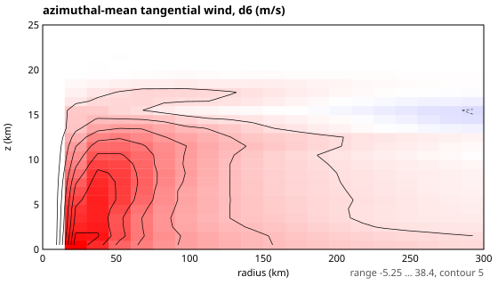
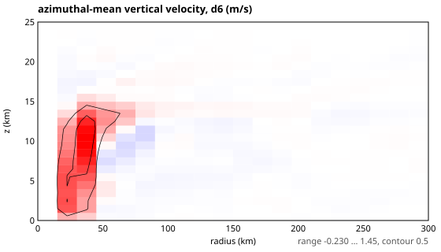
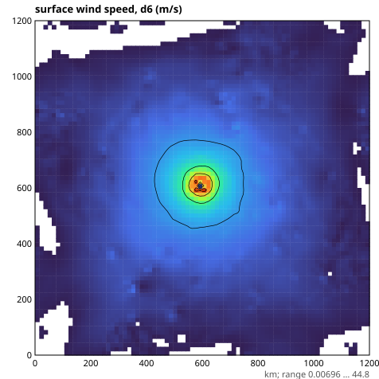
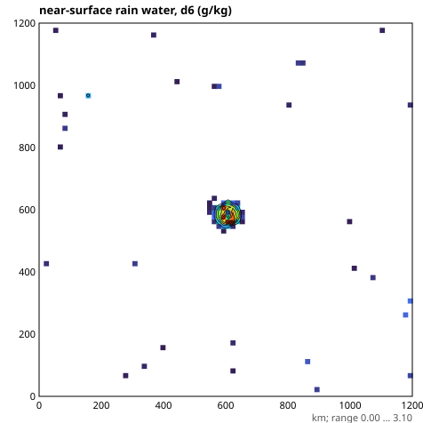
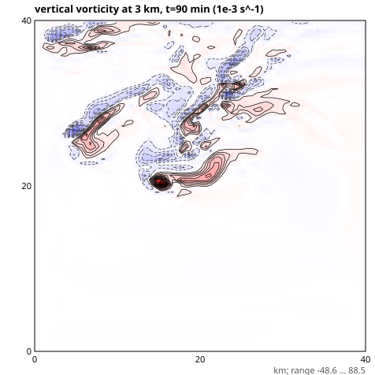
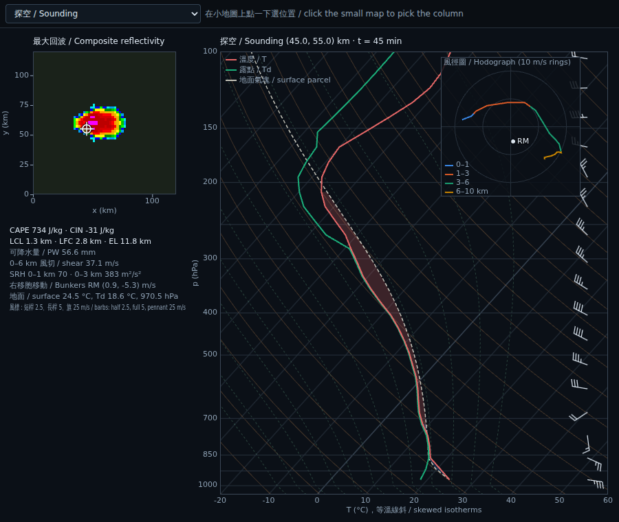
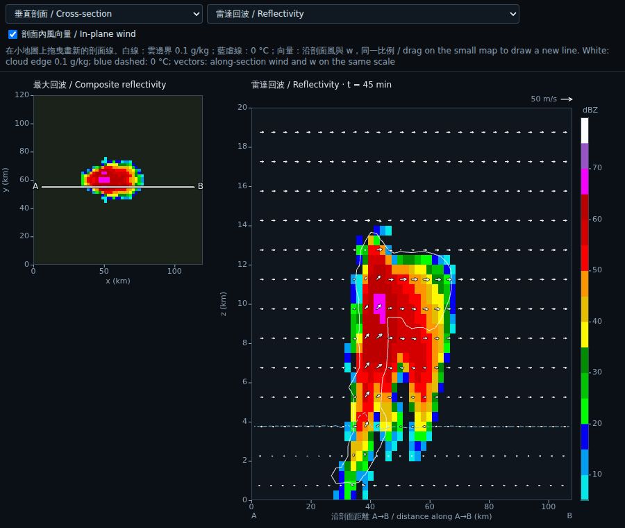
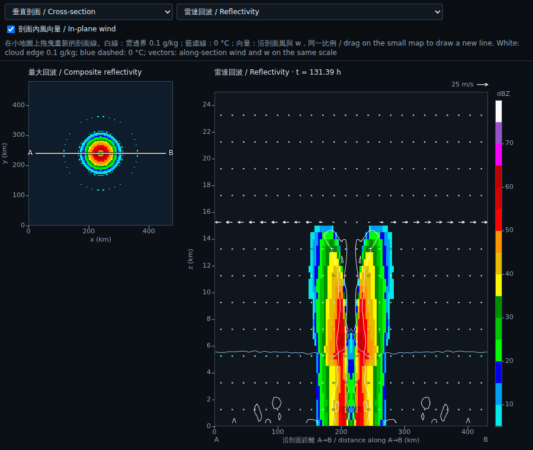
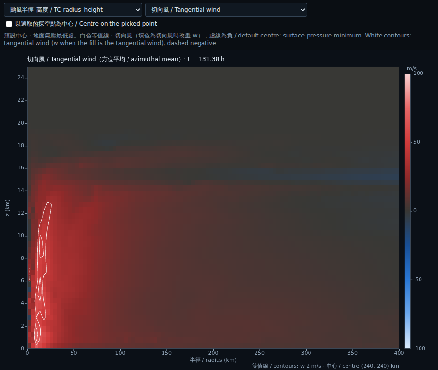

# R2–R5 驗收結果 / Validation results: moist, Earth, GPU, regional（2026-09-27）

與 R1 相同，所有現象都由方程、初始場、邊界條件與物理源項自行演化；沒有任何「生成噴流／ITCZ／季風／颱風／冰雹」的程式。
As in R1, everything evolves from the equations, initial and boundary conditions and physical source terms; no code generates jets, ITCZs, monsoons, cyclones or hail.

圖檔在 `docs/results/`；原始輸出與重現指令見各節。 / Figures are in `docs/results/`; each section gives the command that reproduces it.

## 1. R2 濕灰體水球 / Moist gray aquaplanet (Frierson et al. 2006)

`npm run aquaplanet -- AQUA_T21 300 300` · `node dist/tools/runAquaplanet.js AQUA_T42 200 200`

| 診斷 / Diagnostic | T21（300 日平均 / 300-day mean） | T42（200 日平均 / 200-day mean） | 參考 / Reference (Frierson et al. 2006) |
|---|---|---|---|
| 全球降水 = 蒸發 / Global P = E | 4.24 = 4.25 mm/day | 4.28 = 4.29 mm/day | ≈ 3–4.5 mm/day |
| 對流 / 大尺度降水 / Convective / large-scale | 4.10 / 0.15 | 3.97 / 0.31 | 對流為主 / mostly convective |
| 降水極大 / Precipitation maximum | 7.5 mm/day @ 8.3° | 8.4 mm/day @ ±9.8°（赤道 5.8）| ITCZ 7–15 mm/day |
| 噴流 / Jets | 39.0 / 37.7 m/s @ ±36° | 33.4 / 33.1 m/s @ 49°N / 46°S | 30–40 m/s |
| Hadley 胞 / Hadley cells | ±5.9 × 10¹⁰ kg/s | ±8.0 × 10¹⁰ kg/s | ~10¹¹ kg/s |
| 水收支殘差 / Water-budget residual (200 d) | 0.004 kg/m² | −0.03 kg/m² | — |

熱帶東風、中緯西風、副熱帶乾區（E > P）、中緯度風暴路徑（P > E）與三胞環流都自然出現。T42 的降水在赤道兩側 ±10° 各有一個極大（雙 ITCZ），赤道 SST 極大 310.7 K 處反而較少：這是此簡化模式（灰體輻射、2.5 m slab、SBM）已知的行為，不影響能量與水量收支。
Trades, midlatitude westerlies, subtropical dry zones (E > P), storm tracks (P > E) and the three-cell circulation all emerge. At T42 the precipitation peaks at ±10° (a double ITCZ) with less rain over the 310.7 K equatorial SST maximum, a known behaviour of this simplified configuration (gray radiation, 2.5 m slab, SBM); budgets are unaffected.

## 2. R3 地球：海陸、地形、季節 / Earth: land, orography, seasons (T21)

`node dist/tools/runEarth.js EARTH_T21 3 1`（Byrne & O'Gorman 灰體輻射、季節日照、bucket 陸面、q-flux 海洋、熱力學海冰）。2.1–2.2 是舊預設（陸地反照率 0.42）的結果；新預設見 2.4。 / Sections 2.1–2.2 use the old default land albedo 0.42; see 2.4 for the new default.

### 2.1 季節氣候 / Seasonal climate（3 年 spin-up 後平均 1 年 / 1-year mean after 3 years）

| 區域 / Region | JJA | DJF | 觀測特徵 / Observed |
|---|---|---|---|
| 西伯利亞地表溫度 / Siberia Ts | 282.5 K | 241.1 K | 夏冬差 ~40 K ✔ |
| 撒哈拉 / Sahara Ts | 311.2 K | 287.8 K | 夏季極熱 ✔ |
| 南極 / Antarctica Ts | 225.4 K | 270.0 K | 南半球冬冷 ✔ |
| 西非降水 / West Africa P | 1.33 | 0.01 mm/day | 夏季季風雨 ✔ |
| 南美降水 / South America P | 1.21 | 6.39 mm/day | 南半球夏季雨季 ✔ |
| 澳洲北部 / N Australia P | 3.83 | 5.05 mm/day | 夏季較多 ✔（對比偏弱）|
| 南亞 / South Asia P | 2.88 | 3.60 mm/day | ✘ 應為夏季多雨 |
| 東亞 / East Asia P | 5.01 | 9.39 mm/day | ✘ 應為夏季多雨 |

年平均：噴流 NH 24.9 m/s、SH 31.3 m/s（均在 36°），Hadley 胞 7.3 / −4.7 × 10¹⁰ kg/s，Ferrel 胞 −2.8 / 2.2 × 10¹⁰ kg/s，極地胞存在。
Annual mean: jets 24.9 (NH) and 31.3 m/s (SH) at 36°, Hadley cells 7.3 / −4.7 × 10¹⁰ kg/s, Ferrel cells −2.8 / 2.2 × 10¹⁰ kg/s, polar cells present.

### 2.2 亞洲季風的問題與原因 / Why the Asian monsoon is reversed

逐格點資料（`results/EARTH_T21_y3/climate.json`）顯示：深熱帶陸地（印度南部、東南亞島嶼）比鄰近海洋冷約 10 °C，因為灰體模式的陸地反照率 0.42（高於海洋 0.38，代表雲）加上蒸發冷卻；而沒有洋流的 slab 印度洋高達 34–38 °C。季風所需的「夏季陸地比海洋熱」在深熱帶反轉，對流留在海上；冬季的雨來自溫帶風暴路徑南緣掃過華南，以及孟加拉灣的東風。
The gridded output shows deep-tropical land about 10 °C colder than the adjacent ocean: the gray model's land albedo (0.42, above the ocean's 0.38, both standing in for clouds) plus evaporative cooling, against a slab Indian Ocean at 34–38 °C with no ocean dynamics. The land-warmer-than-sea contrast that drives a monsoon is reversed in the deep tropics, so convection stays over the ocean. The winter rain comes from the southern edge of the storm track over South China and easterlies from the Bay of Bengal.

這是灰體輻射（沒有雲、沒有水汽窗區）的結構性限制，不是數值錯誤；敏感度實驗見 2.4。
This is a structural limit of gray radiation (no clouds, no water-vapour window), not a numerical error; see the sensitivity experiment in 2.4.

### 2.3 熱力學海冰與長期漂移 / Thermodynamic sea ice and the slow drift

之前的海冰只有反照率（slab 可以冷到 245 K）。現在的零層 Semtner (1976) 模式讓混合層在 271.35 K 結冰，冰厚由傳導、表面與底部熱收支決定；單元測試確認能量（混合層 + 冰面層 − 潛熱）守恆到 1e-13，GPU 與 CPU 冰厚相對誤差 9e-6。
Previously sea ice was only an albedo ramp (the slab could cool to 245 K). The zero-layer Semtner (1976) model now freezes the mixed layer at 271.35 K and grows or melts ice from the conductive, surface and basal heat budgets; energy is conserved to 1e-13 and GPU and CPU ice thickness agree to 9e-6.

兩種海冰版本的全球平均地表溫度都以約 0.5–1 K/年緩慢下降（同季節比較），所以漂移不是海冰反照率失控，而是 Byrne–O'Gorman 灰體輻射強烈的水汽回饋下，20 m slab 與大氣緩慢地走向較冷的平衡（年平均約 286–287 K、可降水量 ~21–22 kg/m²）。季節氣候與季風結果在兩個版本中相同（海冰版：南亞 JJA 2.9 / DJF 3.1、東亞 4.3 / 9.0 mm/day）。
With either sea-ice treatment the global mean surface temperature drifts down by about 0.5–1 K per year (same-season comparison). So the drift is not an ice-albedo runaway: under the strong water-vapour feedback of the Byrne–O'Gorman gray scheme, the 20 m slab and atmosphere slowly approach a cooler equilibrium (annual mean about 286–287 K, precipitable water about 21–22 kg/m²). The seasonal climate and monsoon indices are the same in both versions (with thermodynamic ice: South Asia JJA 2.9 / DJF 3.1, East Asia 4.3 / 9.0 mm/day).

### 2.4 陸地反照率敏感度：季風的開關 / Land-albedo sensitivity: the monsoon switch

陸地反照率由 0.42 降為 0.30（海洋維持 0.38，同樣是 3 年積分、平均第 3 年），**五個季風區的季節性全部轉為正確**（表中為 JJA / DJF，mm/day）：
With land albedo lowered from 0.42 to 0.30 (ocean kept at 0.38; 3-year run, third year averaged) **all five monsoon regions get the correct seasonality**:

| 區域 / Region | 0.42 | 0.30 | 0.34 | 0.34 + 觀測 q-flux / observed q-flux |
|---|---|---|---|---|
| 南亞 / South Asia | 2.9 / 3.1 | **4.1 / 2.5** | 3.9 / 2.1 | 5.4 / 6.2 |
| 西非 / West Africa | 0.7 / 0.1 | **5.0 / 1.3** | 3.0 / 0.5 | 7.1 / 3.2 |
| 東亞 / East Asia | 4.3 / 9.0 | **7.1 / 6.0** | 7.2 / 6.4 | **8.6 / 2.3** |
| 澳洲北部 / N Australia | 3.7 / 2.9 | **2.7 / 5.0** | 4.6 / 1.0 | 5.6 / 4.4 |
| 南美 / South America | 1.6 / 6.3 | **1.1 / 7.4** | 1.9 / 7.9 | 5.3 / 7.3 |

另一個實驗把海洋改成觀測的 AMIP 月平均海溫（陸地反照率維持 0.42，`SST=data/sst_amip_2deg.json`）：東亞（JJA 6.5 / DJF 2.0）與西非（4.6 / 2.2）轉為正確，但南亞仍反向（3.4 / 5.5），南半球季風也偏弱。可見兩個因素都有影響：過熱的 slab 印度洋與西太平洋（海洋熱傳輸不足）影響東亞，陸地反照率影響南亞。由這個實驗推導出的海洋熱傳輸（q-flux，Russell et al. 1985 方法；赤道東太平洋湧升 −80 W/m²、赤道印度洋 −61 W/m²、黑潮 +18 W/m²）存成 `data/qflux_gray_t21.json`；「q-flux + 陸地反照率 0.34」的組合積分進行中。
A second experiment prescribes the observed AMIP monthly SST (land albedo kept at 0.42; `SST=data/sst_amip_2deg.json`). East Asia (JJA 6.5 / DJF 2.0) and West Africa (4.6 / 2.2) become correct, but South Asia stays reversed (3.4 / 5.5) and the Southern Hemisphere monsoons are weak. So both factors matter: the overheated slab Indian Ocean and western Pacific (missing ocean heat transport) affect East Asia, and the land albedo affects South Asia. The implied ocean heat transport from this run (q-flux, Russell et al. 1985 method: −80 W/m² in the eastern equatorial Pacific upwelling, −61 W/m² in the equatorial Indian Ocean, +18 W/m² along the Kuroshio) is saved as `data/qflux_gray_t21.json`; a combined run with this q-flux and land albedo 0.34 is in progress.

這證實了 2.2 的診斷：季風由海陸熱力對比驅動，而在灰體模式中這個對比取決於代表「雲＋地表」的反照率。代價是 0.30 時氣候偏暖（全球 ~295 K、撒哈拉夏季 325 K）。

- **0.34**：南亞、西非、東亞（冬夏差偏小）、南美正確，澳洲反向；撒哈拉夏季 317 K。**現在是地球設定的預設值。**
- **0.34 + 觀測推導的海洋熱傳輸**（網頁「T21 + 觀測推導的海洋熱傳輸」選項，`QFLUX=data/qflux_gray_t21.json`）：東亞季風最真實（JJA 8.6 / DJF 2.3），西非、南美正確；南亞接近持平但略反向，澳洲仍反向；赤道太平洋海溫 304 K，比 slab 預設的 306 K 更接近觀測。

兩者各有長短，所以網頁同時提供；五個區域全部正確又不偏暖，仍需要 R7（有雲的非灰體輻射）。

This confirms the diagnosis in 2.2: the monsoon is driven by the land–sea thermal contrast, which in a gray model is set by the albedo standing in for clouds plus surface. At 0.30 the climate runs warm (global mean about 295 K, Sahara summer 325 K).

- **0.34**: South Asia, West Africa, East Asia (winter–summer contrast too small) and South America correct, Australia reversed; Sahara summer 317 K. **This is now the Earth default.**
- **0.34 plus the observation-derived ocean heat transport** (the "T21 + observation-derived ocean heat transport" option in the app, `QFLUX=data/qflux_gray_t21.json`): the most realistic East Asian monsoon (JJA 8.6 / DJF 2.3), West Africa and South America correct; South Asia nearly flat but slightly reversed, Australia still reversed; equatorial Pacific SST 304 K, closer to observations than the 306 K of the default slab.

Each has strengths, so the app offers both; getting all five regions right without a warm bias still needs R7 (non-gray radiation with clouds).

### 2.5 綜觀天氣 / Synoptic weather

`node dist/tools/runSynoptic.js results/EARTH_T21 300 3 24`

北半球冬季（12 月）單一時刻：海平面氣壓（黑線，4 hPa；1500 m 以上地形遮蔽）疊在 850 hPa 溫度上、6 小時降水、250 hPa 風。
- 北太平洋（阿留申）與北大西洋（冰島）附近有深的閉合低壓，南半球 45–60°S 有一串溫帶氣旋；北半球 30–45°N 溫度梯度最強，分開極地冷氣團（850 hPa −50 °C）與熱帶氣團（+23 °C）；250 hPa 噴流 56–58 m/s。
- 降水：太平洋 ~5°N 的東西向 ITCZ 雨帶；南半球風暴路徑中西北–東南走向的斜向鋒面雨帶；北美東岸外海的冬季氣旋強降水；30–50°N 的風暴路徑降水。南極海岸有一條偏強的地形降水帶（T21 陡峭地形）。
- T21（約 600 km）只能呈現寬廣的結構；較銳利的鋒面需要 T42 以上。

A single northern-winter (December) snapshot: sea-level pressure contours (4 hPa, masked above 1500 m) over 850-hPa temperature, 6-hour precipitation and 250-hPa wind.
- Deep closed lows near the Aleutians and Iceland and a train of extratropical cyclones at 45–60°S. The strongest temperature gradient, at 30–45°N, separates polar air (−50 °C at 850 hPa) from tropical air (+23 °C); the 250-hPa jet reaches 56–58 m/s.
- Precipitation: an east–west ITCZ band near 5°N across the Pacific, NW–SE slanting frontal bands in the Southern Hemisphere storm track, heavy winter-cyclone rain off the North American east coast, and storm-track rain at 30–50°N. A band along the Antarctic coast is too strong (orographic, steep T21 terrain).
- At T21 (about 600 km) these structures are broad; sharper fronts need T42 or finer.

## 3. R4 GPU（WebGPU, f32）與 CPU（Float64）一致性 / GPU vs CPU agreement

`npm run test:gpu`（headless Chromium + SwiftShader）

| 測試 / Test | 結果 / Result |
|---|---|
| Held–Suarez T21，100 步 / 100 steps | 相對 L2 1.4e-5 |
| 濕水球 T21，72 步：T / q / SST | 6.6e-5 / 2.1e-3 / < 1e-4 |
| GPU 單獨 20 日 / GPU alone, 20 days | P = E = 4.40 mm/day |
| 地球 T21（海冰、陸面），10 步：Ts / 冰厚 / 土壤水 | 1.9e-5 / 8.8e-6 / 1.3e-4 |
| 區域濕對流（Kessler），10 步：u / θ / qc / qr | 1.3e-6 / 9.9e-8 / 1.0e-5 / 1.5e-5 |
| 區域熱帶氣旋物理，5 步：u / θ / qv | 1.1e-4 / 2.9e-7 / 5.6e-6 |
| 巢狀（開放邊界、海陸地表），10 步：u / w / θ / π′ / qv | 9.5e-7 / 4.1e-4 / 7.7e-8 / 1.1e-5 / 3.1e-7 |
| 冰相微物理，10 步：qv qc qr qi qs qg | 1.5e-7 … 4.8e-6 |

## 4. R5 區域非靜力模式 / Regional non-hydrostatic model

### 4.1 Straka et al. (1993) 密度流 / Density current（Δx = 100 m）
θ′ 最低 −9.66 K（參考 −9.77）、鋒面 15.45 km（參考 15.54）、w −15.9 … 13.2 m/s，左右對稱到 5e-12。
θ′ min −9.66 K (reference −9.77), front at 15.45 km (15.54), w −15.9…13.2 m/s, left–right symmetric to 5e-12.

### 4.2 Weisman–Klemp (1982) 超大胞，六類冰相 / Supercell with ice microphysics
`node dist/tools/runSupercell.js 120 2000 results/supercell_ice ice`

| 時間 / Time | 15 min | 30 min | 60 min | 90 min | 120 min |
|---|---|---|---|---|---|
| 最大上升 / w max (m/s) | 10.9 | 37.7 | 31.9 | 29.6 | 42.4 |
| 雲頂 / cloud top (km) | 4.8 | 14.3 | 13.8 | 14.3 | 13.8 |
| 雲冰 / qi max (g/kg) | 0 | 1.60 | 1.31 | 1.08 | 1.40 |
| 雪 / qs max (g/kg) | 0 | 0.12 | 1.08 | 0.74 | 0.47 |
| 霰 / qg max (g/kg) | 0 | 10.7 | 11.7 | 11.8 | 14.9 |
| 雨 / qr max (g/kg) | 0.85 | 9.18 | 8.89 | 9.02 | 10.7 |
| 最大累積降水 / max accumulated precipitation (mm) | 0 | 2.5 | 30.8 | 32.1 | 32.1 |

暖泡在 15 分鐘內成為深對流，30 分鐘時雲頂達對流層頂（~14 km），並維持 2 小時；60 分鐘時已分裂成左右對稱的兩個旋轉上升氣流（單向風切下的右移與左移胞）。x–z 剖面中霰核心位於上升氣流內、達 12 km，雲冰與雪組成的砧狀雲向下風延伸約 40 km。冰相自然分層：−40 °C 以上的過冷雲水被霰凇附（霰／冰雹核心 11–15 g/kg），砧狀雲由雲冰與雪組成，霰在融化層以下融成雨；−40 °C 以下沒有液態水（測試 6）。與 Kessler 暖雨版本相比，同樣的上升氣流強度（30–40 m/s），但地面最大累積降水 32 mm 對 81 mm：更多凝結物以冰的形式被帶進砧狀雲，降水效率較低。
The bubble becomes deep convection within 15 minutes, reaches the tropopause (about 14 km) by 30 minutes and persists for 2 hours. By 60 minutes it has split into two mirror-image rotating updrafts (right- and left-movers, as expected in straight-line shear). In the x–z section the graupel core sits in the updraft up to 12 km and the ice/snow anvil extends about 40 km downshear. The ice phases sort themselves out: supercooled water is rimed onto graupel (graupel/hail cores of 11–15 g/kg), the anvil is cloud ice and snow, and graupel melts to rain below the melting level. No liquid survives below −40 °C (test 6). Compared with the Kessler warm-rain run, updrafts are similar (30–40 m/s) but the maximum surface accumulation is 32 mm against 81 mm: more condensate is carried into the anvil as ice, so precipitation efficiency is lower.

### 4.3 熱帶氣旋（f 平面，Δx 15 km）/ Tropical cyclone (f-plane, 15 km)
`node dist/tools/runTropicalCyclone.js 8 15000 1200000 results/tc15_ice ice`

| 時間 / Time | 24 h | 48 h | 72 h | 96 h | 120 h | 144 h | 168 h | 192 h |
|---|---|---|---|---|---|---|---|---|
| 最大地面風，冰相 / Vmax, ice (m/s) | 14.9 | 15.3 | 17.8 | 28.4 | 46.0 | 44.8 | 43.0 | 39.5 |
| 最低層最低氣壓 / pmin, lowest level (hPa) | 941.1 | 939.8 | 938.7 | 928.5 | 916.1 | 913.3 | 917.8 | 918.1 |
| 最大風半徑 / RMW (km) | 113 | 143 | 98 | 38 | 23 | 23 | 23 | 23 |
| 最大地面風，Kessler / Vmax, Kessler (m/s) | 14.8 | 15.2 | 19.6 | 32.3 | 38.8 | 38.3 | 40.6 | 42.0 |

28 °C 海面上 15 m/s 的弱渦旋醞釀約 3 天後，在 72–120 h 快速增強（冰相版 48 h 內增加 28 m/s），最大風半徑由 100 km 以上收縮到 23 km，之後在 40–46 m/s 準穩定。第 6 天的方位角平均剖面：眼牆上升氣流是一個位於半徑 20–45 km、從地面伸到 14 km 並隨高度向外傾斜的環，半徑 15 km 以內的眼幾乎沒有上升運動；切向風極大約 38 m/s，位在低層 30–40 km，高層外圍轉為反氣旋外流。眼牆診斷在 96 h 以後一直是單一眼牆（~38 km）。15 km 格距下強度受解析度限制（此海溫的理論潛在強度約 70 m/s）；雙眼牆與眼牆置換需要 2–3 km（GPU，R6）。
A 15 m/s vortex over a 28 °C sea gestates for about 3 days, then intensifies rapidly between 72 and 120 h (28 m/s in 48 h with ice microphysics) while the radius of maximum wind contracts from over 100 km to 23 km, then levels off at 40–46 m/s. Azimuthal means on day 6: the eyewall updraft is a ring at 20–45 km radius, rising from the surface to 14 km and sloping outward with height, around a nearly motionless eye inside 15 km; the tangential wind peaks near 38 m/s at 30–40 km in the lower troposphere and turns anticyclonic in the upper-level outflow. The eyewall diagnostic shows a single eyewall (about 38 km) from 96 h on. At 15 km intensity is resolution-limited (the potential intensity for this SST is about 70 m/s); concentric eyewalls and replacement cycles need 2–3 km (GPU, R6).

### 4.3b 軸對稱快速版熱帶氣旋 / Axisymmetric tropical cyclone (fast version)
`src/regional/axisym.ts`：同樣的方程、數值方法與物理，只算半徑–高度（Δr 4 km、半徑 800 km、Δz 1 km、25 km 深）；
同樣的 28 °C 海面、RE87 初始渦旋、六類冰相、混合長度 1000 / 100 m。本環境（負載中的 CPU）6 天約 11 分鐘。
Same equations, numerics and physics in radius–height only (Δr 4 km to 800 km, Δz 1 km, 25 km deep), same 28 °C sea,
RE87 vortex, six-class ice, mixing lengths 1000 / 100 m. Six days took about 11 minutes on this (loaded) machine.

| 時間 / Time | 24 h | 48 h | 72 h | 96 h | 108 h | 120 h | 132 h | 141 h | 144 h |
|---|---|---|---|---|---|---|---|---|---|
| 最大地面風 / Vmax (m/s) | 11.1 | 11.9 | 12.2 | 15.9 | 19.4 | 38.5 | 62.2 | 69.1 | 65.4 |
| 中心氣壓降 / Δp (hPa) | −4.4 | −3.0 | −5.4 | −7.8 | −9.2 | −15.8 | −31.4 | −43.4 | −41.0 |
| 最大風半徑 / RMW (km) | 166 | 158 | 158 | 18 | 74 | 38 | 22 | 18 | 18 |

醞釀約 4.5 天（比 3D 長，軸對稱模式沒有隨機擾動與非對稱對流），之後 30 小時內由 19 增強到 69 m/s，接近此海溫的潛在強度
（約 70 m/s）；3D 15 km 受解析度限制只到 40–46 m/s。適合先篩選參數（最小陣風、輻射冷卻、混合長度、海溫），再到 3D 確認。
測試：靜止大氣保持靜止、平衡渦旋 3 小時不變、角動量守恆（含亂流混合）、軸對稱暖泡長成降雨的深對流（`node dist/tests/axisym.js`）。
Gestation takes about 4.5 days (longer than in 3-D: no random perturbations or asymmetric convection), then the storm
intensifies from 19 to 69 m/s within 30 hours, close to the potential intensity for this SST (about 70 m/s), whereas the 3-D
15 km run is resolution-limited at 40–46 m/s. Use it to screen parameters (gustiness, radiative cooling, mixing lengths, SST)
before a 3-D run. Tests: rest stays at rest, a balanced vortex stays steady for 3 hours, angular momentum is conserved (also
with mixing), an axisymmetric warm bubble grows into a raining deep updraft (`node dist/tests/axisym.js`).
Sweeps: `node dist/tools/runAxisym.js days=6 sweep=vmin:1,3,5`（每個 CPU 核心一組 / one run per CPU core）.

### 4.3c 雨帶與雙眼牆：軸對稱篩選 / Rainbands and concentric eyewalls: axisymmetric screening
`node dist/tools/runAxisym.js days=8 dr=4000 cases='base|vmin:4|radc:1|rh12:0.6|radc:1.5+vmin:4|radc:2+vmin:4'`
（CSV 另有核心 < 60 km 與外圍 100–300 km 的平均降雨率、外圍雨環數 / the CSV also has core and outer mean rain rates and the number of outer rain rings）

成熟期（最大風首次 ≥ 40 m/s 之後）的平均 / Means over the mature stage (after Vmax first reaches 40 m/s):

| 設定 / Setting (Δr 4 km) | 外圍雨量 / Outer rain (mm/h) | 外圍雨環 / Outer rings | 核心雨量 / Core rain (mm/h) | RMW (km) |
|---|---|---|---|---|
| 基準 / baseline（vmin 1、向探空鬆弛 / relaxation） | 0.03–0.05 | 3–4 | 23–25 | 20–25 |
| vmin 4 m/s | 0.25 | 7 | 18 | 20 |
| 固定冷卻 / constant cooling 1 K/day | 0.30 | 3 | 17 | 14 |
| 12 km RH 0.6 | 0.02 | 2–3 | 28 | 21 |
| vmin 4 ＋ 冷卻 / cooling 1.5 K/day | 0.24 | 5 | 6 | 7 |
| vmin 4 ＋ 冷卻 / cooling 2 K/day | 0.32 | 6 | 2 | 5 |
| vmin 4，Δr 2 km，10 天 / 10 days | 0.01 | 6 | 16 | 11 |

- 軸對稱模式裡，成熟颱風外圍幾乎不下雨；最小陣風 4 m/s 或固定冷卻能保留一些外圍雨（0.25–0.3 mm/h），但固定冷卻會讓
  眼牆一路收縮到軸心附近（RMW 5–7 km、核心雨量掉到 2–6 mm/h），是軸對稱模式的已知弱點；中層較濕沒有幫助。
  解析度加倍（Δr 2 km）後，vmin 4 的外圍雨又掉回 0.01 mm/h，所以軸對稱的外圍雨是很弱、依賴解析度的訊號：
  雨帶本質上是非軸對稱的，要以 3D 結果為準（下一節）。
- 雙眼牆：Δr 2 km（vmin 4）、Δr 4 km 海溫 30 °C、Δr 4 km 緯度 30°，各積分 10 天，全部只有單一眼牆，收縮到半徑 9–12 km 後維持
  （最大風 67–75 m/s）；沒有出現次眼牆。軸對稱模式沒有外圍雨帶（上表），缺少次眼牆最常見的來源，所以雙眼牆要靠 3D 3 km（GPU）。
- In the axisymmetric model a mature storm has almost no outer rain; a 4 m/s minimum wind or constant cooling keeps some
  (0.25–0.3 mm/h), but constant cooling lets the eyewall contract nearly to the axis (RMW 5–7 km, core rain down to 2–6 mm/h), a known
  weakness of axisymmetric models; a moister mid troposphere does not help. At twice the resolution (Δr 2 km) the vmin-4 outer rain drops
  back to 0.01 mm/h, so the axisymmetric outer rain is a weak, resolution-dependent signal: rainbands are inherently asymmetric, and the
  3-D runs decide (next section).
- Concentric eyewalls: Δr 2 km (vmin 4), Δr 4 km with a 30 °C sea, and Δr 4 km at 30° latitude, ten days each, all keep a single eyewall
  that contracts to 9–12 km and stays there (67–75 m/s); no secondary eyewall forms. Without outer rainbands (above), the axisymmetric
  model lacks the usual source of a secondary eyewall, so concentric eyewalls are left to the 3-D 3 km run (GPU).

### 4.3d 雨帶：3D 15 km 對照 / Rainbands: 3-D 15 km comparison
`node dist/tools/runTropicalCyclone.js 8 15000 1200000 <out> ice vmin=1 | vmin=4 | vmin=4 radc=1.5`（每 3 小時印核心／外圍雨量
與外圍 > 1 mm/h 的面積比 / prints core and outer rain and the outer area fraction above 1 mm/h every 3 h）

每格：最大地面風 m/s／最低氣壓 hPa／外圍 100–300 km 平均雨量 mm/h／外圍降雨面積 %
Each cell: max surface wind m/s / minimum pressure hPa / outer (100–300 km) mean rain mm/h / outer raining area %

| 設定 / Setting | 24 h | 48 h | 72 h | 96 h | 120 h | 144 h |
|---|---|---|---|---|---|---|
| A 基準 / baseline（vmin 1、鬆弛 / relaxation） | 15 / 941 / 0.12 / 2.4 | 16 / 940 / 0.49 / 12.6 | 19 / 939 / 0.59 / 10.2 | 19 / 934 / 0.14 / 3.7 | 42 / 919 / 0.03 / 0.6 | 47 / 910 / 0.02 / 0.1 |
| B vmin 4 m/s | 14 / 941 / 0.13 / 3.1 | 15 / 940 / 0.46 / 11.6 | 17 / 939 / 0.40 / 8.2 | 21 / 935 / 0.44 / 6.6 | 38 / 922 / 0.04 / 0.7 | 42 / 917 / 0.01 / 0.1 |
| C vmin 4 ＋ 冷卻 / cooling 1.5 K/day | 18 / 944 / 0.46 / 9.7 | 23 / 939 / 0.26 / 4.5 | 56 / 904 / 0.06 / 1.4 | 61 / 900 / 0.02 / 0.5 | 55 / 906 / 0.03 / 0.5 | 58 / 901 / 0.01 / 0.0 |

成熟期（最大風 ≥ 40 m/s 之後）平均外圍雨量：A 0.022、B 0.024、C 0.058 mm/h；外圍降雨面積 0.3 %、0.3 %、1.2 %。
醞釀期三組外圍都有 0.35–0.5 mm/h、8–12 % 面積在下雨，颱風一成熟就消失。最小陣風 4 m/s 在 3D 沒有差別；固定冷卻讓颱風
提早兩天增強、更強（56–61 m/s，氣壓 900–906 hPa），但成熟後外圍同樣幾乎無雨。雨量圖上外圍只有零星、一格大小的陣雨
（15 km 網格上的格點尺度對流），沒有組織成帶狀。可能原因：15 km 沒有積雲參數化、水平混合長度 3 km（0.2·Δx），
解析不了雨帶的對流；1200 km 的週期區域裡，眼牆外流的補償下沉遍及整個區域，也可能壓抑外圍對流。
預設不改；在 5 km／3 km（GPU，對流可以直接解析）比較預設與 vmin 4。
Mature-stage (after 40 m/s) mean outer rain: A 0.022, B 0.024, C 0.058 mm/h; outer raining area 0.3, 0.3, 1.2 %. During gestation
all three have 0.35–0.5 mm/h and 8–12 % raining area in the outer region, which disappears once the storm matures. A 4 m/s minimum
wind makes no difference in 3-D; constant cooling makes the storm intensify two days earlier and stronger (56–61 m/s, 900–906 hPa),
but the mature outer region is just as dry. The rain maps show only scattered one-cell showers outside the core (grid-scale convection
on a 15 km grid), never organised into bands. Likely reasons: at 15 km there is no cumulus parameterisation and the horizontal mixing
length is 3 km (0.2·Δx), so rainband convection is not resolved; and in a 1200 km periodic domain the compensating subsidence of the
eyewall outflow covers the whole domain and may suppress outer convection. Defaults unchanged; compare the default and vmin 4 at
5 km / 3 km on the GPU, where convection is explicit.

### 4.4 單向巢狀：全球模式中的區域預報 / One-way nest inside the Earth model
`node dist/tools/runNest.js results/EARTH_T21 auto 30 24 20`

`auto` 選在全球模式 6 小時降水極大處（24.9°N, 95.6°W，墨西哥灣西岸，27.5 mm/day），1200 km 見方、Δx 20 km、六類冰相；全球模式同時繼續積分，每 3 小時提供新的側邊界目標（時間內插）。
`auto` picks the global model's 6-hour precipitation maximum (24.9°N, 95.6°W, western Gulf of Mexico coast, 27.5 mm/day); 1200 km square, Δx 20 km, six-class ice. The global model keeps running and supplies new lateral-boundary targets every 3 hours, interpolated in time.

- 24 小時穩定。第一版在側邊界鬆弛區出現大量假降水（邊緣 24 小時達 239 mm）：全球模式的水汽在區域模式的溫度／氣壓換算下略為過飽和，鬆弛不斷強迫凝結。修正：內插後的水汽以區域狀態的飽和值為上限。修正後邊界降水大幅減少，降水集中在內部的鋒面雨帶。
- 內部（排除鬆弛區）平均降水 28.5 mm/day；全球模式在同一範圍 21.7 mm/day（T21 下只有 1 個格點，比較僅供參考）。
- 地表風最大 22–24 m/s，雲量 ~40%，最大上升 ~2 m/s（20 km 格距下的大尺度抬升）。

- Stable for 24 h. The first version rained heavily in the lateral relaxation zone (up to 239 mm per 24 h at the edges): global humidity was slightly supersaturated under the regional temperature/pressure mapping, so the relaxation kept forcing condensation. Fix: interpolated vapour is capped at saturation for the regional state. Boundary rain is now much smaller and the precipitation is concentrated in the interior frontal band.
- Interior mean (relaxation zone excluded) 28.5 mm/day; the global model gives 21.7 mm/day over the same box (only one T21 grid point, so indicative only).
- Maximum surface wind 22–24 m/s, cloud cover about 40%, maximum ascent about 2 m/s (resolved large-scale lift at 20 km).

### 4.5 龍捲尺度超大胞環境：CPU 粗網格預覽 / Tornado-scale supercell set-up: coarse CPU preview
`node dist/tools/runTornado.js 120`（Δx 500 m、40 km、開放側邊界、區域隨風暴移動）

WK82 探空、四分之一圓風徑圖、地面對數律摩擦。第一版用週期性 30 km 區域：風暴吞回自己的冷外流，約一小時後衰亡，追蹤器也曾誤鎖到遠處的上升氣流。改成向環境鬆弛的開放邊界、追蹤器只在風暴附近搜尋並以伽利略座標平移跟隨後，風暴持續兩小時並停在區域中央：上升氣流 45–55 m/s、雲頂 15 km、3 km 渦度 0.05 s⁻¹（中尺度氣旋）、近地面渦度增加到 0.02 s⁻¹、對地風 16 m/s。500 m 解析不了龍捲；網頁的 250 m GPU 版本才是觀察龍捲是否自然生成的設定（R6）。
WK82 sounding, quarter-circle hodograph, log-law surface drag. The first version used a periodic 30 km domain: the storm ingested its own cold outflow and died after about an hour, and the tracker once locked onto a distant updraft. With open boundaries relaxing to the environment, and a tracker that searches only near the storm and follows it by a Galilean frame shift, the storm lasts two hours and stays centred: updrafts 45–55 m/s, cloud top 15 km, 3-km vorticity 0.05 s⁻¹ (a mesocyclone), near-surface vorticity growing to 0.02 s⁻¹, ground-relative wind 16 m/s. 500 m cannot resolve a tornado; the app's 250 m GPU version is the set-up for seeing whether one forms (R6).

### 4.5b 強低層風切環境：500 m 就出現類龍捲渦旋 / Strong low-level shear: a tornado-like vortex already at 500 m
`node dist/tools/runTornado.js 120 500 40000 40 400 3 results/tornado_500m`（新預設環境 / new default environment）

四分之一圓風徑圖改成 12 m/s、深 1 km（0–1 km 風暴相對螺旋度約 280 m²/s²，舊的約 120），邊界層水氣上限 16 g/kg
（CAPE 約 3200 J/kg、雲底約 0.9 km）。同樣 500 m、40 km 開放邊界、跟隨風暴：

| 時間 / Time (min) | 30 | 60 | 75 | 80 | 85 | 95 | 100 | 110 | 120 |
|---|---|---|---|---|---|---|---|---|---|
| 最大上升 / w max (m/s) | 56 | 63 | 48 | 40 | 60 | 65 | 59 | 59 | 57 |
| 3 km 渦度 / ζ at 3 km (s⁻¹) | 0.042 | 0.035 | 0.044 | 0.046 | 0.073 | 0.083 | 0.074 | 0.059 | 0.049 |
| 地面渦度 / ζ near the ground (s⁻¹) | 0.004 | 0.013 | 0.026 | 0.068 | 0.098 | 0.104 | 0.092 | 0.062 | 0.075 |
| 對地風 / ground-relative wind (m/s) | 10.9 | 15.7 | 22.7 | 32.3 | 34.4 | 34.8 | 36.1 | 26.5 | 26.2 |

約 80 分鐘時近地面渦度在 5 分鐘內由 0.026 增到 0.068 s⁻¹，85–100 分鐘維持約 0.1 s⁻¹、對地風 34–36 m/s（EF0 範圍，
龍捲偵測器的門檻），110 分鐘後減弱：一個約 20–25 分鐘的類龍捲渦旋，完全由方程產生。舊環境（WK82）同樣設定兩小時只到
0.02 s⁻¹、16 m/s。500 m 仍太粗，渦旋寬度只有幾格；250 m（GPU）應該更強、更窄。
With the quarter circle changed to 12 m/s over 1 km (0–1 km storm-relative helicity about 280 m²/s², formerly about 120) and a
16 g/kg boundary layer (CAPE about 3200 J/kg, cloud base about 0.9 km), the same 500 m, 40 km, open-boundary, storm-following run
produces a tornado-like vortex: near-surface vorticity jumps from 0.026 to 0.068 s⁻¹ within five minutes at about 80 min, stays near
0.1 s⁻¹ with 34–36 m/s ground-relative winds (EF0 range, the detector's threshold) from 85 to 100 min, and decays after 110 min, a
lifecycle of about 20–25 minutes produced by the equations alone. The former WK82 environment reached only 0.02 s⁻¹ and 16 m/s in
two hours. At 500 m the vortex is only a few cells wide; at 250 m (GPU) it should be narrower and stronger.

### 4.6 區域模式圖表範例 / Chart examples
網頁「區域模式」主畫面的圖表（本環境用 CPU 先跑出成熟狀態存檔，再匯入頁面截圖）。
Charts on the regional page (mature states computed on the CPU here, saved, and loaded into the page for the screenshots).

超大胞（WK82 環境、2 km、45 分鐘）：地面氣塊斜溫圖（CAPE/CIN 陰影、風標）與風徑圖（Bunkers 右移胞、0–1 / 0–3 km SRH）；
沿風暴畫的雷達回波剖面（白線雲邊界、藍虛線 0 °C、剖面內風向量）。
Supercell (WK82 environment, 2 km, 45 min): skew-T with the surface parcel (CAPE/CIN shading, barbs) and hodograph (Bunkers right
mover, 0–1 / 0–3 km SRH); a reflectivity cross-section through the storm (cloud edge, 0 °C line, in-plane wind).

軸對稱颱風（28 °C、Δr 4 km，約 131 小時，最大風 71–76 m/s、RMW 10 km）：通過中心的雷達回波剖面（眼、眼牆、0 °C 融解層、
15 km 外流）與方位平均切向風（白線：上升速度每 2 m/s）。
Axisymmetric tropical cyclone (28 °C, Δr 4 km, about 131 h, 71–76 m/s, RMW 10 km): reflectivity through the centre (eye, eyewall,
melting level, 15 km outflow) and the azimuthal-mean tangential wind (white: vertical velocity every 2 m/s).

## 5. 尚未達成 / Not yet achieved

- 亞洲季風的季節性（見 2.2）→ R7 非灰體輻射與雲。
- 颱風外圍雨帶（15 km 與軸對稱都沒有，見 4.3c、4.3d）、雙眼牆、眼牆置換 → 5 km／3 km GPU（使用者的顯卡）。
- 龍捲風 → R6（50–250 m LES）。
- 全球模式的降水相態仍是診斷（灰體物理沒有融解潛熱）；區域模式已有完整冰相。

- Asian monsoon seasonality (2.2) → R7, non-gray radiation and clouds.
- Tropical-cyclone outer rainbands (absent at 15 km and in the axisymmetric model, 4.3c, 4.3d), concentric eyewalls, replacement cycles → 5 km / 3 km on the GPU (the user's card).
- Tornadoes → R6 (50–250 m LES).
- Precipitation phase in the global model is still diagnostic (the gray physics has no latent heat of fusion); the regional model has full ice microphysics.
