# R2–R5 驗收結果 / Validation results: moist, Earth, GPU, regional（2026-09-27）

與 R1 相同，所有現象都由方程、初始場、邊界條件與物理源項自行演化；沒有任何「生成噴流／ITCZ／季風／颱風／冰雹」的程式。
As in R1, everything evolves from the equations, initial and boundary conditions and physical source terms; no code generates jets, ITCZs, monsoons, cyclones or hail.

圖檔在 `docs/results/`；原始輸出與重現指令見各節。 / Figures are in `docs/results/`; each section gives the command that reproduces it.

## 1. R2 濕灰體水球 / Moist gray aquaplanet (Frierson et al. 2006)

`npm run aquaplanet -- AQUA_T21 300 300` · `node dist/tools/runAquaplanet.js AQUA_T42 200 200`

| 診斷 / Diagnostic | T21（300 日平均 / 300-day mean） | T42（200 日平均 / 200-day mean） | 參考 / Reference (Frierson et al. 2006) |
|---|---|---|---|
| 全球降水 = 蒸發 / Global P = E | 4.24 = 4.25 mm/day | 4.28 = 4.29 mm/day | ≈ 3–4.5 mm/day |
| 對流 / 大尺度降水 / Convective / large-scale | 4.10 / 0.15 | 3.97 / 0.31 | 對流為主 / mostly convective |
| 降水極大 / Precipitation maximum | 7.5 mm/day @ 8.3° | 8.4 mm/day @ ±9.8°（赤道 5.8）| ITCZ 7–15 mm/day |
| 噴流 / Jets | 39.0 / 37.7 m/s @ ±36° | 33.4 / 33.1 m/s @ 49°N / 46°S | 30–40 m/s |
| Hadley 胞 / Hadley cells | ±5.9 × 10¹⁰ kg/s | ±8.0 × 10¹⁰ kg/s | ~10¹¹ kg/s |
| 水收支殘差 / Water-budget residual (200 d) | 0.004 kg/m² | −0.03 kg/m² | — |

熱帶東風、中緯西風、副熱帶乾區（E > P）、中緯度風暴路徑（P > E）與三胞環流都自然出現。T42 的降水在赤道兩側 ±10° 各有一個極大（雙 ITCZ），赤道 SST 極大 310.7 K 處反而較少：這是此簡化模式（灰體輻射、2.5 m slab、SBM）已知的行為，不影響能量與水量收支。
Trades, midlatitude westerlies, subtropical dry zones (E > P), storm tracks (P > E) and the three-cell circulation all emerge. At T42 the precipitation peaks at ±10° (a double ITCZ) with less rain over the 310.7 K equatorial SST maximum, a known behaviour of this simplified configuration (gray radiation, 2.5 m slab, SBM); budgets are unaffected.

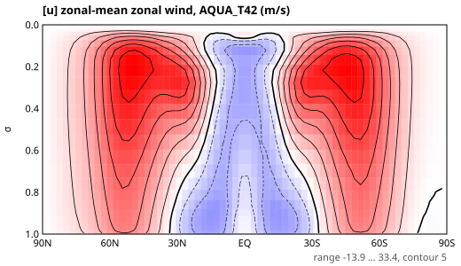
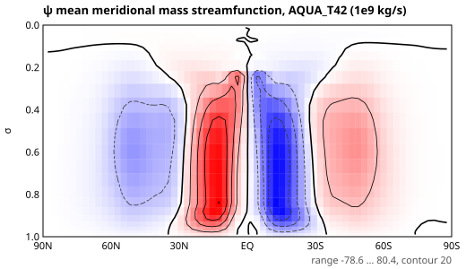
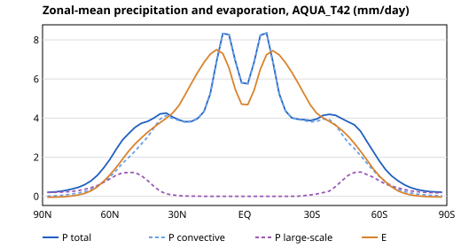

## 2. R3 地球：海陸、地形、季節 / Earth: land, orography, seasons (T21)

`node dist/tools/runEarth.js EARTH_T21 3 1`（Byrne & O'Gorman 灰體輻射、季節日照、bucket 陸面、q-flux 海洋、熱力學海冰）

### 2.1 季節氣候 / Seasonal climate（3 年 spin-up 後平均 1 年 / 1-year mean after 3 years）

| 區域 / Region | JJA | DJF | 觀測特徵 / Observed |
|---|---|---|---|
| 西伯利亞地表溫度 / Siberia Ts | 282.5 K | 241.1 K | 夏冬差 ~40 K ✔ |
| 撒哈拉 / Sahara Ts | 311.2 K | 287.8 K | 夏季極熱 ✔ |
| 南極 / Antarctica Ts | 225.4 K | 270.0 K | 南半球冬冷 ✔ |
| 西非降水 / West Africa P | 1.33 | 0.01 mm/day | 夏季季風雨 ✔ |
| 南美降水 / South America P | 1.21 | 6.39 mm/day | 南半球夏季雨季 ✔ |
| 澳洲北部 / N Australia P | 3.83 | 5.05 mm/day | 夏季較多 ✔（對比偏弱）|
| 南亞 / South Asia P | 2.88 | 3.60 mm/day | ✘ 應為夏季多雨 |
| 東亞 / East Asia P | 5.01 | 9.39 mm/day | ✘ 應為夏季多雨 |

年平均：噴流 NH 24.9 m/s、SH 31.3 m/s（均在 36°），Hadley 胞 7.3 / −4.7 × 10¹⁰ kg/s，Ferrel 胞 −2.8 / 2.2 × 10¹⁰ kg/s，極地胞存在。
Annual mean: jets 24.9 (NH) and 31.3 m/s (SH) at 36°, Hadley cells 7.3 / −4.7 × 10¹⁰ kg/s, Ferrel cells −2.8 / 2.2 × 10¹⁰ kg/s, polar cells present.

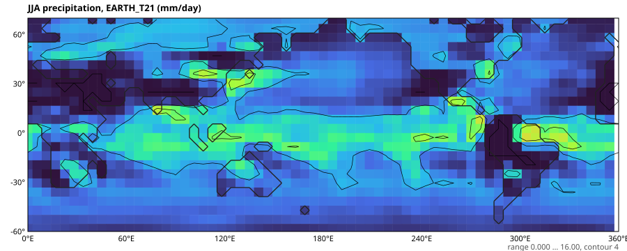
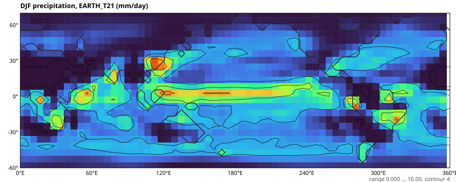
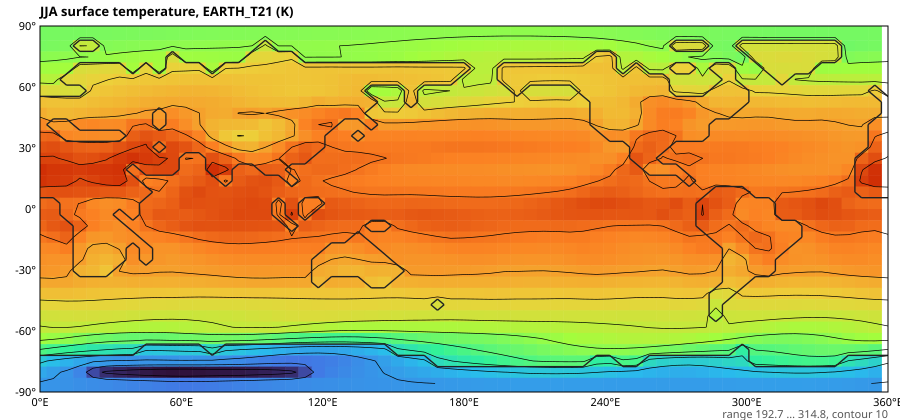
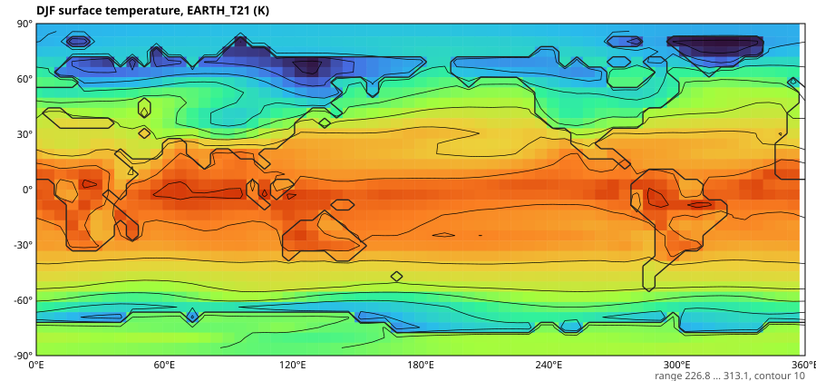

### 2.2 亞洲季風的問題與原因 / Why the Asian monsoon is reversed

逐格點資料（`results/EARTH_T21_y3/climate.json`）顯示：深熱帶陸地（印度南部、東南亞島嶼）比鄰近海洋冷約 10 °C，因為灰體模式的陸地反照率 0.42（高於海洋 0.38，代表雲）加上蒸發冷卻；而沒有洋流的 slab 印度洋高達 34–38 °C。季風所需的「夏季陸地比海洋熱」在深熱帶反轉，對流留在海上；冬季的雨來自溫帶風暴路徑南緣掃過華南，以及孟加拉灣的東風。
The gridded output shows deep-tropical land about 10 °C colder than the adjacent ocean: the gray model's land albedo (0.42, above the ocean's 0.38, both standing in for clouds) plus evaporative cooling, against a slab Indian Ocean at 34–38 °C with no ocean dynamics. The land-warmer-than-sea contrast that drives a monsoon is reversed in the deep tropics, so convection stays over the ocean. The winter rain comes from the southern edge of the storm track over South China and easterlies from the Bay of Bengal.

這是灰體輻射（沒有雲、沒有水汽窗區）的結構性限制，不是數值錯誤。短期敏感度實驗（陸地反照率 0.30）見 2.4；根本改善列為 R7（非灰體輻射與雲）。
This is a structural limit of gray radiation (no clouds, no water-vapour window), not a numerical error. A land-albedo sensitivity experiment is in 2.4; the real fix is R7 (non-gray radiation and clouds).

### 2.3 熱力學海冰 / Thermodynamic sea ice

之前的海冰只有反照率（SST 可以一路冷到 245 K），年平均地表溫度每年下降約 1 K。現在的零層 Semtner (1976) 模式讓混合層在 271.35 K 結冰，冰厚由傳導、表面與底部熱收支決定；單元測試確認能量（混合層 + 冰面層 − 潛熱）守恆到 1e-13，GPU 與 CPU 冰厚相對誤差 9e-6。
Previously sea ice was an albedo ramp only (the slab could cool to 245 K) and the mean surface temperature drifted down about 1 K per year. The zero-layer Semtner (1976) model now freezes the mixed layer at 271.35 K and grows or melts ice from the conductive, surface and basal heat budgets. A unit test shows energy (mixed layer + ice surface layer − latent heat) conserved to 1e-13; GPU and CPU ice thickness agree to 9e-6.

### 2.4 綜觀天氣 / Synoptic weather

`node dist/tools/runSynoptic.js results/EARTH_T21 300 3 24`

北半球冬季（12 月）單一時刻：海平面氣壓（黑線，4 hPa；1500 m 以上地形遮蔽）疊在 850 hPa 溫度上、6 小時降水、250 hPa 風。
- 北太平洋（阿留申）與北大西洋（冰島）附近有深的閉合低壓，南半球 45–60°S 有一串溫帶氣旋；北半球 30–45°N 溫度梯度最強，分開極地冷氣團（850 hPa −50 °C）與熱帶氣團（+23 °C）；250 hPa 噴流 56–58 m/s。
- 降水：太平洋 ~5°N 的東西向 ITCZ 雨帶；南半球風暴路徑中西北–東南走向的斜向鋒面雨帶；北美東岸外海的冬季氣旋強降水；30–50°N 的風暴路徑降水。南極海岸有一條偏強的地形降水帶（T21 陡峭地形）。
- T21（約 600 km）只能呈現寬廣的結構；較銳利的鋒面需要 T42 以上。

A single northern-winter (December) snapshot: sea-level pressure contours (4 hPa, masked above 1500 m) over 850-hPa temperature, 6-hour precipitation and 250-hPa wind.
- Deep closed lows near the Aleutians and Iceland and a train of extratropical cyclones at 45–60°S. The strongest temperature gradient, at 30–45°N, separates polar air (−50 °C at 850 hPa) from tropical air (+23 °C); the 250-hPa jet reaches 56–58 m/s.
- Precipitation: an east–west ITCZ band near 5°N across the Pacific, NW–SE slanting frontal bands in the Southern Hemisphere storm track, heavy winter-cyclone rain off the North American east coast, and storm-track rain at 30–50°N. A band along the Antarctic coast is too strong (orographic, steep T21 terrain).
- At T21 (about 600 km) these structures are broad; sharper fronts need T42 or finer.

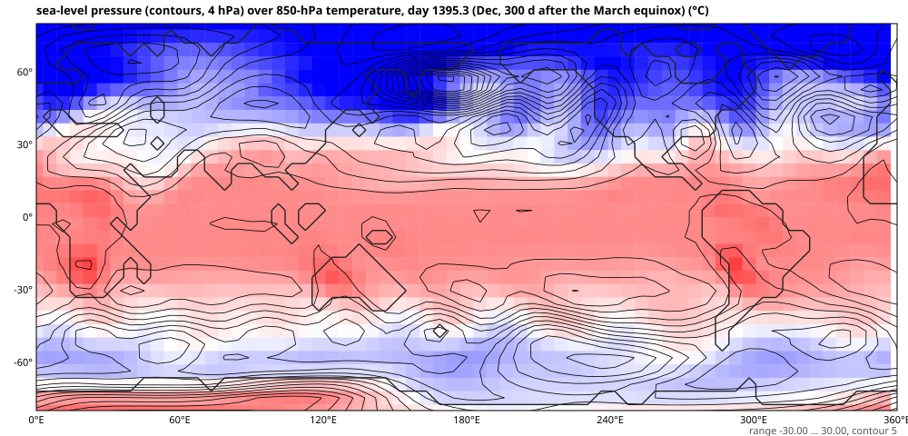
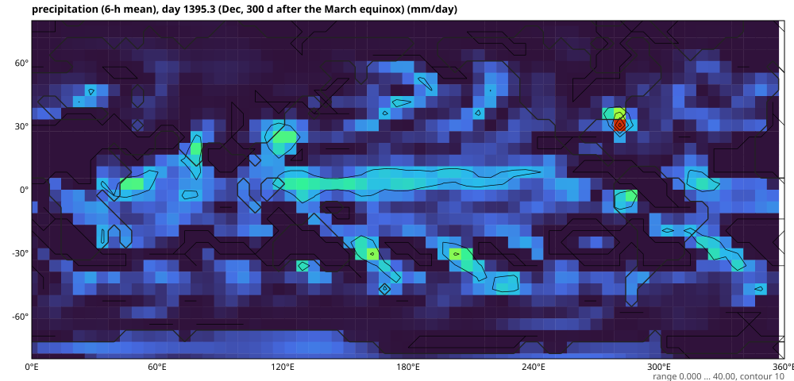
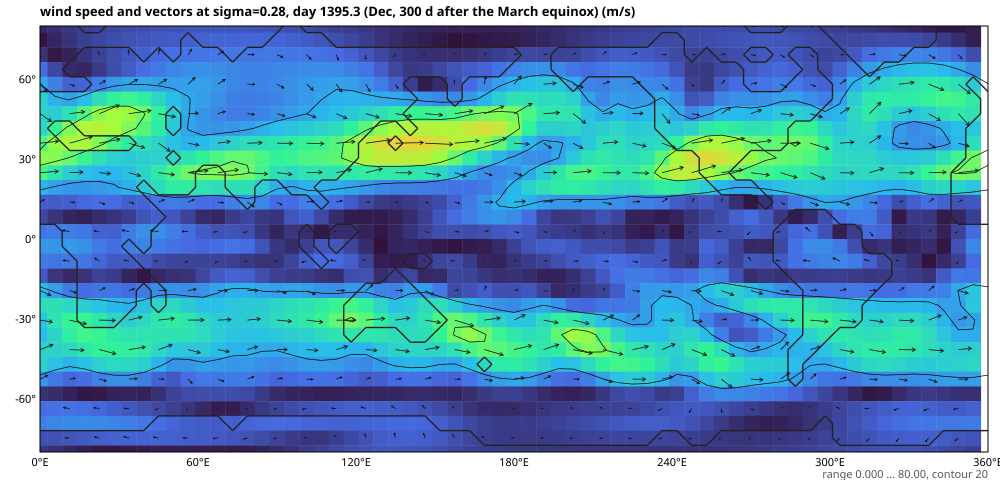

## 3. R4 GPU（WebGPU, f32）與 CPU（Float64）一致性 / GPU vs CPU agreement

`npm run test:gpu`（headless Chromium + SwiftShader）

| 測試 / Test | 結果 / Result |
|---|---|
| Held–Suarez T21，100 步 / 100 steps | 相對 L2 1.4e-5 |
| 濕水球 T21，72 步：T / q / SST | 6.6e-5 / 2.1e-3 / < 1e-4 |
| GPU 單獨 20 日 / GPU alone, 20 days | P = E = 4.40 mm/day |
| 地球 T21（海冰、陸面），10 步：Ts / 冰厚 / 土壤水 | 1.9e-5 / 8.8e-6 / 1.3e-4 |
| 區域濕對流（Kessler），10 步：u / θ / qc / qr | 1.3e-6 / 9.9e-8 / 1.0e-5 / 1.5e-5 |
| 區域熱帶氣旋物理，5 步：u / θ / qv | 1.1e-4 / 2.9e-7 / 5.6e-6 |
| 巢狀（開放邊界、海陸地表），10 步：u / w / θ / π′ / qv | 9.5e-7 / 4.1e-4 / 7.7e-8 / 1.1e-5 / 3.1e-7 |
| 冰相微物理，10 步：qv qc qr qi qs qg | 1.5e-7 … 4.8e-6 |

## 4. R5 區域非靜力模式 / Regional non-hydrostatic model

### 4.1 Straka et al. (1993) 密度流 / Density current（Δx = 100 m）
θ′ 最低 −9.66 K（參考 −9.77）、鋒面 15.45 km（參考 15.54）、w −15.9 … 13.2 m/s，左右對稱到 5e-12。
θ′ min −9.66 K (reference −9.77), front at 15.45 km (15.54), w −15.9…13.2 m/s, left–right symmetric to 5e-12.

### 4.2 Weisman–Klemp (1982) 超大胞，六類冰相 / Supercell with ice microphysics
`node dist/tools/runSupercell.js 120 2000 results/supercell_ice ice`

| 時間 / Time | 15 min | 30 min | 60 min | 90 min | 120 min |
|---|---|---|---|---|---|
| 最大上升 / w max (m/s) | 10.9 | 37.7 | 31.9 | 29.6 | 42.4 |
| 雲頂 / cloud top (km) | 4.8 | 14.3 | 13.8 | 14.3 | 13.8 |
| 雲冰 / qi max (g/kg) | 0 | 1.60 | 1.31 | 1.08 | 1.40 |
| 雪 / qs max (g/kg) | 0 | 0.12 | 1.08 | 0.74 | 0.47 |
| 霰 / qg max (g/kg) | 0 | 10.7 | 11.7 | 11.8 | 14.9 |
| 雨 / qr max (g/kg) | 0.85 | 9.18 | 8.89 | 9.02 | 10.7 |
| 最大累積降水 / max accumulated precipitation (mm) | 0 | 2.5 | 30.8 | 32.1 | 32.1 |

暖泡在 15 分鐘內成為深對流，30 分鐘時雲頂達對流層頂（~14 km），並維持 2 小時。冰相自然分層：−40 °C 以上的過冷雲水被霰凇附（霰／冰雹核心 11–15 g/kg），砧狀雲由雲冰與雪組成，霰在融化層以下融成雨；−40 °C 以下沒有液態水（測試 6）。與 Kessler 暖雨版本相比，同樣的上升氣流強度（30–40 m/s），但地面最大累積降水 32 mm 對 81 mm：更多凝結物以冰的形式被帶進砧狀雲，降水效率較低。
The bubble becomes deep convection within 15 minutes, reaches the tropopause (about 14 km) by 30 minutes and persists for 2 hours. The ice phases sort themselves out: supercooled water is rimed onto graupel (graupel/hail cores of 11–15 g/kg), the anvil is cloud ice and snow, and graupel melts to rain below the melting level. No liquid survives below −40 °C (test 6). Compared with the Kessler warm-rain run, updrafts are similar (30–40 m/s) but the maximum surface accumulation is 32 mm against 81 mm: more condensate is carried into the anvil as ice, so precipitation efficiency is lower.

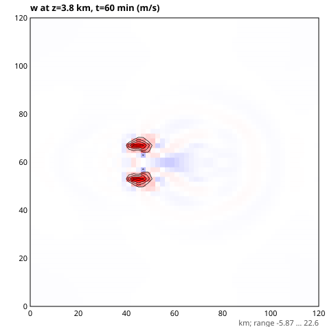
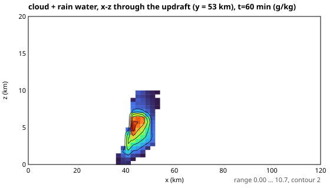
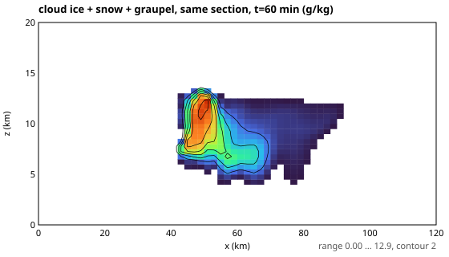
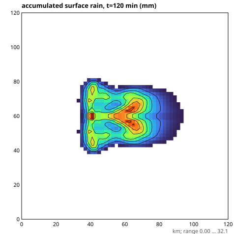

### 4.3 熱帶氣旋（f 平面，Δx 15 km，Kessler）/ Tropical cyclone (f-plane, 15 km, Kessler)
`node dist/tools/runTropicalCyclone.js 8 15000`

| 時間 / Time | 24 h | 48 h | 72 h | 96 h | 120 h | 144 h | 168 h | 192 h |
|---|---|---|---|---|---|---|---|---|
| 最大地面風 / Vmax (m/s) | 14.8 | 15.2 | 19.6 | 32.3 | 38.8 | 38.3 | 40.6 | 42.0 |
| 最大風半徑 / RMW (km) | 98 | 83 | 53 | 23 | 38 | 23 | 23 | 23 |

28 °C 海面上 15 m/s 的弱渦旋在 2–3 天的醞釀後，於 72–108 h 快速增強（24 h 內增加約 20 m/s），最大風半徑由 98 km 收縮到 23 km，之後在 ~40 m/s 準穩定：15 km 格距無法解析眼牆，強度受解析度限制（此海溫的理論潛在強度約 70 m/s）。眼牆、多眼牆與眼牆置換需要 2–3 km 格距（GPU，R6）。
A 15 m/s vortex over a 28 °C sea gestates for 2–3 days, intensifies rapidly between 72 and 108 h (about 20 m/s in 24 h) while the radius of maximum wind contracts from 98 to 23 km, then levels off near 40 m/s: at 15 km the eyewall is unresolved and intensity is resolution-limited (the potential intensity for this SST is about 70 m/s). Eyewalls, concentric eyewalls and replacement cycles need 2–3 km grids (GPU, R6).

### 4.4 單向巢狀：全球模式中的區域預報 / One-way nest inside the Earth model
`node dist/tools/runNest.js results/EARTH_T21 auto 30 24 20`

`auto` 選在全球模式 6 小時降水極大處（24.9°N, 95.6°W，墨西哥灣西岸，27.5 mm/day），1200 km 見方、Δx 20 km、六類冰相；全球模式同時繼續積分，每 3 小時提供新的側邊界目標（時間內插）。
`auto` picks the global model's 6-hour precipitation maximum (24.9°N, 95.6°W, western Gulf of Mexico coast, 27.5 mm/day); 1200 km square, Δx 20 km, six-class ice. The global model keeps running and supplies new lateral-boundary targets every 3 hours, interpolated in time.

- 24 小時穩定，無邊界雜訊；區域平均降水 31.9 mm/day，全球模式在同一範圍 14.3 mm/day（只有 3 個全球格點）。符號與量級一致；區域模式的顯式微物理與較高解析度產生更強的降水，單向巢狀不強制與母模式水量一致。
- 地表風最大 22 m/s，雲量 ~43%，最大上升 ~2 m/s（20 km 格距下的大尺度抬升）。
- 較早的 Kessler 12 小時測試：18.8 vs 15.6 mm/day。

- Stable for 24 h with no boundary noise; domain-mean precipitation is 31.9 mm/day against 14.3 mm/day from the global model over the same box (only 3 global points). Same sign and order of magnitude: the explicit microphysics and finer grid produce heavier rain, and one-way nesting does not constrain the water budget to the parent's.
- Maximum surface wind 22 m/s, cloud cover about 43%, maximum ascent about 2 m/s (resolved large-scale lift at 20 km).
- An earlier 12-hour Kessler test gave 18.8 against 15.6 mm/day.

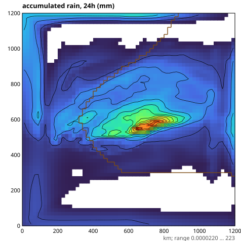
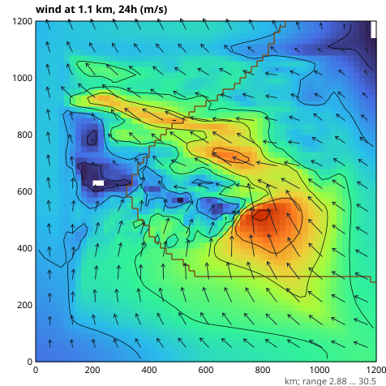
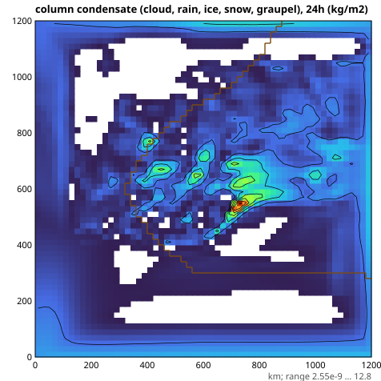

## 5. 尚未達成 / Not yet achieved

- 亞洲季風的季節性（見 2.2）→ R7 非灰體輻射與雲。
- 颱風眼牆、雙眼牆、眼牆置換 → R6（2–3 km、GPU、長時間積分）。
- 龍捲風 → R6（50–250 m LES）。
- 全球模式的降水相態仍是診斷（灰體物理沒有融解潛熱）；區域模式已有完整冰相。

- Asian monsoon seasonality (2.2) → R7, non-gray radiation and clouds.
- Tropical-cyclone eyewalls, concentric eyewalls, replacement cycles → R6 (2–3 km, GPU, long runs).
- Tornadoes → R6 (50–250 m LES).
- Precipitation phase in the global model is still diagnostic (the gray physics has no latent heat of fusion); the regional model has full ice microphysics.
